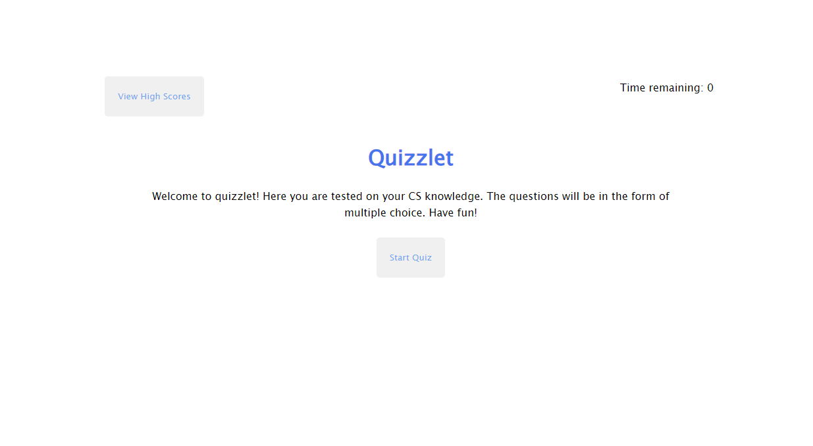

# Evan's Profile Page

## Description

The goal of this project is to create a quiz like web application where you can add questions to the question bank and be used to generate a quiz. The great thing about this application is that it can be reused as an api in other applications easily. By selecting the buttons as your answer you are able to answer the multiple choice questions. In addition, the application will generate a score for you which will be saved in the local storage. You can then go view the highscores on the main page by pressing the view highscores button. This will take you to a new page with the scores and the option to clear the high scores which will automatically clear the storaged local data.

## Link
https://evan17812.github.io/quizzlet/

## Screenshot
